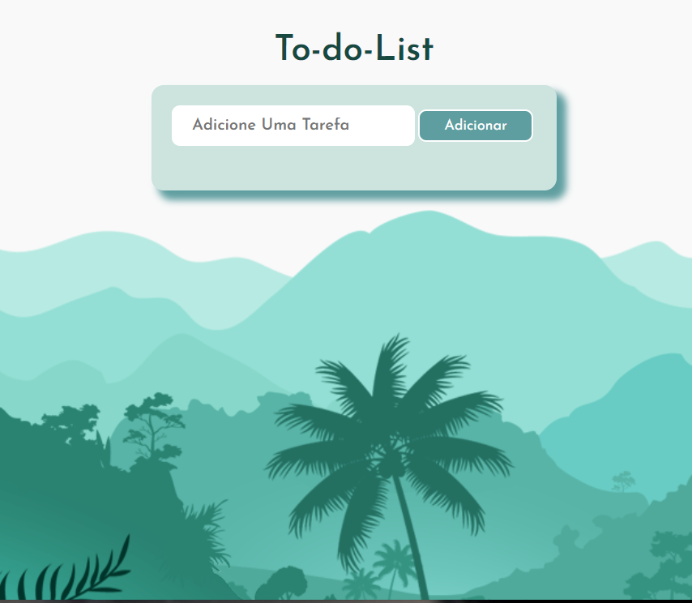

Projeto To-do-List  
( Lista de Tarefas )

  <a href="#-tecnologias">Tecnologias</a>&nbsp;&nbsp;&nbsp;|&nbsp;&nbsp;&nbsp;
  <a href="#-projeto">Projeto</a>&nbsp;&nbsp;&nbsp;|&nbsp;&nbsp;&nbsp;
  <a href="#-layout">Layout</a>&nbsp;&nbsp;&nbsp;|&nbsp;&nbsp;&nbsp;
  <a href="#memo-licença">Licença</a>

  
<h2 align="center">To-do-List</h2>

 

  

## 🚀 Tecnologias

Esse projeto foi desenvolvido com as seguintes tecnologias:

- HTML
- CSS
- JavaScript
- Git e Github

## 💻 Projeto

Este Projeto foi Desenvolvido como Finalilade de por em pratica o Conhecimento e as Habilidade para quem esta em Inicio de Carreira!  
Utilizando-se da Tecnicas com LocalStorage para armazenar os dados apos o recarregamento da pagina  
O Projeto funciona como uma Lista de Tarefas, onde você pode adicionar tarefas na caixa de pesquisa, e apos conclui-las você pode marca-las como Feita ou Cancelada!
A aplicação tambem foi desenvolvida para Responsivo para usuarios Mobile.

## 🔖 Layout

## :memo: Licença

Esse projeto está sob a licença MIT.

---
<h2>

Feito com ♥ by Ricardo A Costa 💻
</h2> 
<h1>

Mentorado Por Rodolfo Mori. 
@DEVCLUB</h1>